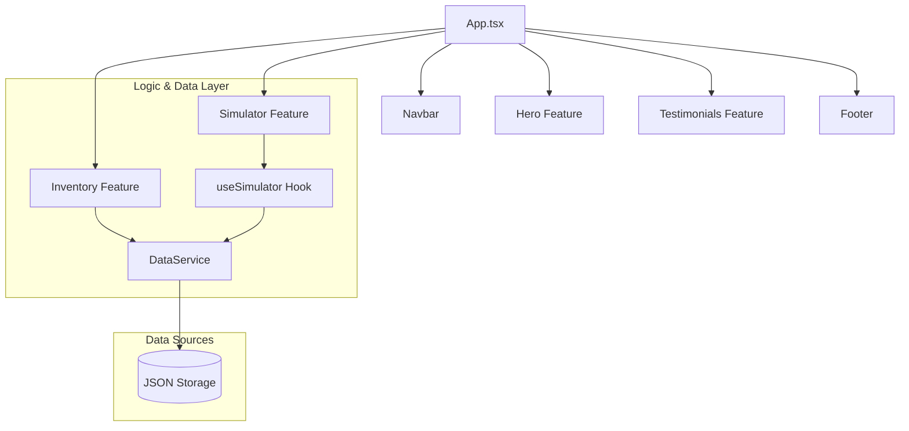

# Paulo Veículos | Premium Automotive Platform

Modern automotive marketplace platform built with React 18, TypeScript and Tailwind CSS, focused on premium user experience, responsive design and scalable frontend architecture.

The platform delivers a modern vehicle browsing experience with fluid animations, real-time financial simulation and performance-oriented rendering workflows.

---

# Overview

This project modernizes a vehicle dealership platform through a modular frontend architecture designed for scalability, maintainability and responsive user interaction.

The application follows a feature-based architecture, isolating business modules and shared services to improve long-term maintainability and development workflows.

---

# React Architecture



---

# System Architecture

The platform is organized into isolated feature modules and shared infrastructure layers.

## Core Layers

### UI Components

Reusable global interface components:

- Navigation
- Footer
- Shared layout elements
- Reusable UI patterns

### Feature Modules

Business-oriented isolated modules:

- Hero section
- Vehicle inventory
- Financial simulator
- Testimonials system

### Hooks Layer

Custom hooks responsible for:

- State abstraction
- Shared business logic
- Reactive calculations
- UI interaction workflows

### Services Layer

Responsible for:

- Data access abstraction
- Centralized data communication
- Inventory loading
- Shared business services

---

# Technology Stack

| Layer | Technology |
|---|---|
| Frontend | React 18 |
| Build Tool | Vite |
| Language | TypeScript |
| Styling | Tailwind CSS |
| Animations | Framer Motion |
| Icons | Lucide React |
| PWA | Service Worker + Offline Support |

---

# Directory Structure

```text
src/
├── components/         # Shared UI components
├── features/           # Isolated business modules
├── hooks/              # Custom hooks and shared logic
├── services/           # Data abstraction layer
├── data/               # JSON-based data repository
├── styles/             # Global Tailwind configuration
└── App.tsx             # SPA orchestrator
```

---

# Features

- Real-time financial simulation
- Reactive calculation workflows
- Mobile-first responsive interface
- Swipe-enabled carousel interactions
- Progressive Web App (PWA) support
- Optimized image loading
- Lightweight production bundles
- Smooth UI animations and transitions
- Modular feature-based architecture
- Type-safe financial processing

---

# Performance Optimizations

The platform was designed with a performance-oriented frontend architecture, including:

- Optimized asset delivery
- Reduced bundle size with Vite
- Lazy rendering strategies
- Efficient state management
- Responsive rendering pipelines
- Mobile-first interaction workflows

---

# Development Setup

## Install dependencies

```bash
npm install
```

---

# Development Environment

```bash
npm run dev
```

---

# Production Build

```bash
npm run build
```

---

# Engineering Principles

- Feature-Based Architecture
- Separation of Concerns (SoC)
- Modular Frontend Design
- Responsive-First Development
- Performance-Oriented Rendering
- Type-Safe Business Logic
- Maintainable Component Structure

---

# Use Cases

- Automotive marketplaces
- Vehicle dealership platforms
- Product showcase applications
- Responsive e-commerce interfaces
- Financial simulation systems

---

# License

© 2024 Paulo Veículos. All rights reserved.
