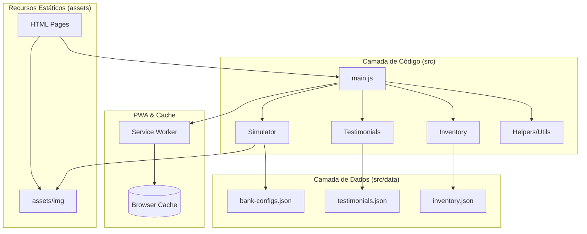

# Paulo Veículos - Portal de Vendas Automotivas

Solução enterprise modular para a concessionária Paulo Veículos. O sistema foi reestruturado de um legado procedural para uma arquitetura moderna orientada a módulos e dados.

## 🏗️ Arquitetura do Sistema

O projeto adota uma abordagem de **Separação de Preocupações (SoC)**, onde a lógica de negócio, os dados e a interface do usuário são tratados de forma independente através de módulos ES6.

### Diagrama de Arquitetura



## 🚀 Tecnologias e Padrões

- **Engine**: Vanilla JavaScript (ES6+ Modules)
- **Styling**: Modular CSS (Layout, Components, Variables) em `src/css/`
- **Data Layer**: Fetch API + JSON Storage em `src/data/`
- **Assets**: Organizados em `assets/img/`
- **Offline First**: Service Worker + Web Manifest
- **DevOps**: ESLint, Prettier, Vercel Build Scripts

## 📂 Estrutura de Diretórios

```text
├── assets/
│   └── img/            # Ativos visuais (veículos, atores, logos)
├── src/                # Código fonte e dados
│   ├── css/            # Arquitetura de estilos modular
│   │   └── pages/      # CSS específico por rota
│   ├── data/           # Repositório de dados estáticos (JSON)
│   ├── js/             
│   │   ├── modules/    # Lógica de negócio encapsulada
│   │   ├── utils/      # Utilitários, Polyfills e Registro de SW
│   │   └── main.js     # Orquestrador da aplicação
│   └── fonts/          # Fontes locais
├── index.html          # Ponto de entrada (Landing Page)
└── simulador-financiamento.html # Módulo de simulação financeira
```

## 🛠️ Configuração de Desenvolvimento

Para executar o projeto localmente:

1. Instale as ferramentas de suporte:
   ```bash
   npm install
   ```

2. Inicie o servidor de desenvolvimento:
   ```bash
   npm start
   ```

3. Valide o padrão de código:
   ```bash
   npm run validate
   ```

## 📈 Melhorias Estratégicas

1. **Organização Industrial**: Separação clara entre código fonte (`src/`) e recursos estáticos (`assets/`).
2. **Desacoplamento de Dados**: Migração de arrays hardcoded para arquivos JSON externos.
3. **Ciclo de Vida de Módulos**: Inicialização gerenciada por orquestrador centralizado.
4. **Redução de Payload**: Centralização de scripts e estilos, reduzindo código inline.

---
© 2024 Paulo Veículos. Desenvolvido com foco em escalabilidade e performance.
