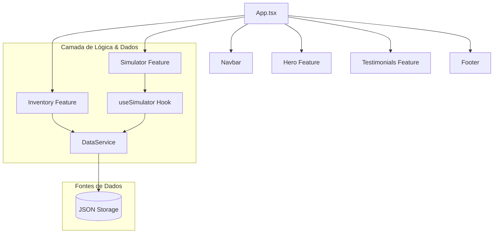

# Paulo Veículos | Premium React Experience

Plataforma de revenda de automóveis modernizada para **React 18**, **TypeScript** e **Tailwind CSS**. O sistema oferece uma experiência de usuário premium com design Clean & Modern, animações fluidas e um simulador financeiro de alta precisão.

## 🏗️ Arquitetura React

O projeto utiliza uma estrutura modular baseada em **Features**, facilitando a manutenção e escalabilidade.



## 🚀 Tecnologias Core

- **Frontend**: React 18 + Vite
- **Tipagem**: TypeScript
- **Estilização**: Tailwind CSS (Design System Customizado)
- **Animações**: Framer Motion (Micro-interações e Reveals)
- **Ícones**: Lucide React
- **PWA**: Suporte para instalação e modo offline

## 📂 Estrutura de Diretórios

```text
src/
├── components/         # Componentes globais de UI (Navbar, Footer)
├── features/           # Módulos de negócio isolados (Hero, Inventory, Simulator)
├── hooks/              # Custom hooks para lógica compartilhada
├── services/           # Camada de comunicação com dados (DataService)
├── data/               # Repositório de dados JSON
├── styles/             # Configurações globais de Tailwind
└── App.tsx             # Orquestrador da SPA
```

## 🛠️ Como Executar

1. Instale as dependências:
   ```bash
   npm install
   ```

2. Inicie o ambiente de desenvolvimento:
   ```bash
   npm run dev
   ```

3. Para build de produção:
   ```bash
   npm run build
   ```

## 📈 Diferenciais da Versão React

1. **Simulador em Tempo Real**: Cálculos reativos processados instantaneamente com feedback visual.
2. **Mobile First Premium**: Interface otimizada para toque (swipe no carrossel) e 100% responsiva para iOS/Android.
3. **Performance Extrema**: Carregamento otimizado de imagens e bundle reduzido via Vite.
4. **Segurança de Tipos**: Lógica financeira blindada com interfaces TypeScript.

---
© 2024 Paulo Veículos. Redefinindo a experiência de compra de seminovos.
